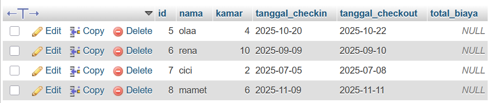

**🏨 Manajemen Hotel Sederhana**

Aplikasi Manajemen Hotel Sederhana merupakan program berbasis Java Swing dengan dukungan MySQL Database. Program ini dibuat untuk membantu pengelolaan data tamu hotel secara sederhana. Pengguna dapat menambahkan data tamu, melihat daftar tamu yang sedang menginap, menghitung total biaya secara otomatis berdasarkan lama menginap, serta menghapus data tamu yang sudah selesai menginap.

**Deskripsi Umum**

Aplikasi ini menampilkan antarmuka grafis berupa jendela dengan beberapa form input seperti nama tamu, nomor kamar, tanggal check-in, dan tanggal check-out. Selain itu, tersedia juga tombol untuk menambah dan menghapus tamu serta tabel yang menampilkan seluruh data tamu yang tersimpan di database. Saat pengguna menambahkan tamu baru, sistem akan menghitung secara otomatis total biaya menginap dengan tarif tetap sebesar dua ratus lima puluh ribu rupiah per malam. Hasil perhitungan akan tersimpan ke database dan tampil di tabel.

**Struktur Program**

Aplikasi ini dibagi menjadi tiga bagian utama.
Bagian pertama adalah DBConnection.java, yang berfungsi untuk mengatur koneksi antara program Java dan database MySQL. File ini berisi konfigurasi koneksi agar Java dapat mengakses data yang tersimpan di MySQL.

Bagian kedua adalah HotelApp.java, yaitu inti dari aplikasi yang menggabungkan antara tampilan antarmuka (GUI) dan logika program. Di dalamnya terdapat elemen-elemen seperti input data tamu, tombol aksi untuk menambah dan menghapus tamu, serta tabel yang menampilkan data tamu dari database. File ini juga berisi perhitungan otomatis untuk menentukan total biaya berdasarkan lama menginap.

Bagian ketiga adalah Main.java, yang berfungsi untuk menjalankan aplikasi. File ini berisi method utama yang memanggil antarmuka HotelApp agar tampil kepada pengguna.

**Struktur Database**

Aplikasi ini menggunakan database bernama hotel_db dengan satu tabel utama bernama tamu. Tabel ini memiliki kolom untuk menyimpan informasi tamu seperti id, nama, nomor kamar, tanggal check-in, tanggal check-out, dan total biaya. Kolom id digunakan sebagai identitas unik setiap tamu. Kolom nama menyimpan nama tamu, kolom kamar menyimpan nomor kamar, kolom tanggal check-in dan check-out menyimpan tanggal menginap, sementara kolom total biaya menyimpan hasil perhitungan biaya berdasarkan lama menginap dikalikan dengan harga per malam.

**Cara Menjalankan Program**

Untuk menjalankan aplikasi ini, pastikan Java Development Kit (JDK) dan MySQL sudah terpasang di komputer. Pengguna perlu mengatur koneksi database pada file DBConnection agar sesuai dengan pengaturan MySQL di perangkatnya. Setelah semua file berada di folder yang sama, aplikasi dapat dijalankan menggunakan perintah kompilasi dan eksekusi Java melalui terminal. Ketika dijalankan, jendela GUI akan muncul dan siap digunakan.

**Fitur Program**

Aplikasi ini menyediakan fitur untuk menambah data tamu, melihat daftar tamu yang sedang menginap, menghapus data tamu berdasarkan ID, serta menghitung total biaya secara otomatis. Total biaya dihitung dengan mengalikan lama menginap (selisih antara tanggal check-in dan check-out) dengan harga tetap per malam. Tabel pada tampilan utama akan selalu menampilkan data yang tersimpan di database dan dapat diperbarui menggunakan tombol refresh.

Selain itu, aplikasi juga memiliki fitur tambahan berupa proses thread pengingat otomatis. Thread ini berjalan di latar belakang untuk memantau tamu yang sudah melewati tanggal check-out dan menampilkan notifikasi di konsol sebagai pengingat.

**Kesimpulan**

Program Manajemen Hotel Sederhana merupakan contoh penerapan pemrograman berorientasi objek, antarmuka pengguna berbasis Swing, serta integrasi database MySQL. Aplikasi ini mampu melakukan operasi dasar seperti menambah, melihat, dan menghapus data, serta melakukan perhitungan otomatis berdasarkan logika bisnis sederhana. Dengan tampilan GUI yang mudah digunakan dan alur kerja yang jelas, program ini dapat dijadikan dasar untuk pengembangan sistem manajemen hotel yang lebih kompleks di masa depan.

**Output**

Hasil Database

Hasil Running

